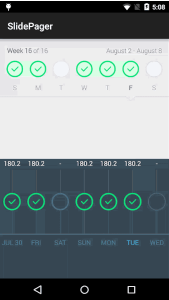

SlidePager
================
A ViewPager implementation that is useful for navigating through views that can be grouped, such as days in a week (API 14+).

To include in your project, add this to your build.gradle file:

```
   //SlidePager
   compile 'com.github.omadahealth.slidepager:slidepager:1.5.0@aar'
```


========
### By
Developers:
        [Olivier Goutay](https://github.com/olivierg13) and [Stoyan Dimitrov](https://github.com/StoyanD)

Designers:
        [Yassine Bentaieb](http://yassinebentaieb.com/)

### Usage

Look at the example app for a live example on how to use the library.

#### In XML:

```
  <com.github.omadahealth.slidepager.lib.SlidePager
      android:id="@+id/slidepager1"
      android:layout_width="match_parent"
      android:layout_height="wrap_content"
      style="@style/SlidePagerStyle"/>
```

#### In styles.xml

```
    <style name="SlidePagerStyle">
        <item name="android:layout_height">match_parent</item>
        <item name="android:layout_width">match_parent</item>

        <item name="slide_start_at_end">true</item>
        <item name="slide_show_streaks">true</item>
        <item name="slide_show_week">true</item>
        <item name="slide_show_date">true</item>
    </style>
```

========

### Customization

You can change several attributes in the XML file:

* app:slide_progress_completed_fill_color [color hex] --> The fill color when the progress is at 100%
* app:slide_progress_completed_reach_color [color hex] --> The reach color(border) when the progress == 100%
* app:slide_progress_not_completed_reach_color [color hex] --> The reach color(border) when the progress < 100%
* app:slide_progress_not_completed_outline_color [color hex] --> The outline color(border) when the progress < 100%
* app:slide_progress_not_completed_fill_color [color hex] --> The fill color(border) when the progress < 100%
* app:slide_progress_special_reach_color [color hex] --> The reach color(border) when the progress < 100%
* app:slide_progress_special_outline_color [color hex] --> The outline color(border) when the progress < 100%
* app:slide_progress_special_fill_color [color hex] --> The fill color(border) when the progress < 100%
* app:slide_start_at_end [boolean] --> True if you want the pager to start at the last page instead of 0
* app:slide_show_streaks [boolean] --> True if you want the connecting streaks to appear between consecutive 100% progress views
* app:slide_show_week [boolean] --> True if you want to show the left text view
* app:slide_show_date [boolean] --> True if you want to show the right text view

========

### Credits

* We used CircularBarPager from OrangeGangsters (https://github.com/OrangeGangsters/CircularBarPager) for the progress circles
* We used NineOldAndroids from JakeWharton (https://github.com/JakeWharton/NineOldAndroids/) to use beautiful animations on API 10+
* We used AnimationEasingFunctions from daimajia (https://github.com/daimajia/AnimationEasingFunctions) to also use beautiful animations on API 10+

========

### License

```
The MIT License (MIT)

Copyright (c) 2015 Omada Health, Inc

Permission is hereby granted, free of charge, to any person obtaining a copy
of this software and associated documentation files (the "Software"), to deal
in the Software without restriction, including without limitation the rights
to use, copy, modify, merge, publish, distribute, sublicense, and/or sell
copies of the Software, and to permit persons to whom the Software is
furnished to do so, subject to the following conditions:

The above copyright notice and this permission notice shall be included in all
copies or substantial portions of the Software.

THE SOFTWARE IS PROVIDED "AS IS", WITHOUT WARRANTY OF ANY KIND, EXPRESS OR
IMPLIED, INCLUDING BUT NOT LIMITED TO THE WARRANTIES OF MERCHANTABILITY,
FITNESS FOR A PARTICULAR PURPOSE AND NONINFRINGEMENT. IN NO EVENT SHALL THE
AUTHORS OR COPYRIGHT HOLDERS BE LIABLE FOR ANY CLAIM, DAMAGES OR OTHER
LIABILITY, WHETHER IN AN ACTION OF CONTRACT, TORT OR OTHERWISE, ARISING FROM,
OUT OF OR IN CONNECTION WITH THE SOFTWARE OR THE USE OR OTHER DEALINGS IN THE
SOFTWARE.
```